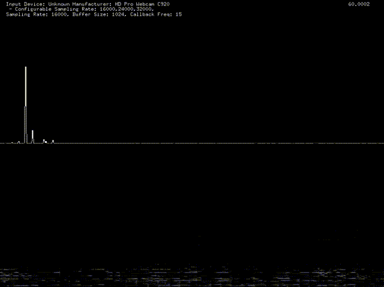

# ofxbSoundUtils

It makes it easier to get FFT and Spetrogram result. If you want to use sound output, please be sure to put audioOut function on ofApp.h as audio callback function.

## Usage
```
void setup()
{
    // Case.1
    // buffer size: 1024
    // open system default input device with lowest sampling rate
    // no output
    sound_utils.setup(1024);

    // Case.2
    // buffer size: 1024
    // open system default input device with 44100 Hz.
    // no output
    // sound_utils.setup(1024, 44100);

    // Case.3
    // buffer size: 1024
    // open system default input device with lowest sampling rate
    // open system default output device with the same sampling rate of defaul tinput device.
    //sound_utils.setup(1024, true);

    // Case.4
    // buffersize: 1024
    // open system default input device with 48000
    // open system default output device with 48000
    // sound_utils.setup(1024, 48000, true);
}
void update()
{
    sound_utils.update();
}
void draw()
{
    sound_utils.drawSpectrum(0,0, ofGetWidth(), ofGetHeight()/2);
    sound_utils.drawSpectrogram(0, ofGetHeight()/2, ofGetWidth(), ofGetHeight()/2);
    sound_utils.drawSettings(20,20)
}
```

## Compatiblility
 * only macOS (tested 10.14.3 mojave)
 * of version: 0.10.1

## Licence
https://opensource.org/licenses/MIT

## Author
https://github.com/TetsuakiBaba
